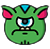

# __Арканоид___
Моя первая игра в которой я использовал питон и библиотеку пайгейм.

## Объекты
В моей игре было три вида объектов:
### _ball_

Первый объект о котором я расскажу _ball_ или мяч. Этот объект играет ключевую роль в игре.  
При соприкосновении этого объекта с врагом _monster_ , враг исчезает.  
Этот объект отскакивает от платформы _platform_ , а также от трёх стен кроме нижней.  

### _enemy_

Объект враг или _monster_ выглядит как монстр, как видно на картинке.  
Как я говорил ранее он исчезает при соприкосновении с мячом _ball_ ,   
как только не останется врагов игрок побеждает.  

### _platform_

И последний объект платформа или _platform_.  
Этим объектом управляет игрок. Мяч _ball_ отскакивает от платформы _platform_.

## Победа и поражение
Как я говорил, как только не останется врагов игрок побеждает.  
И он проигрывает если мяч соприкасается с нижней стеной.

